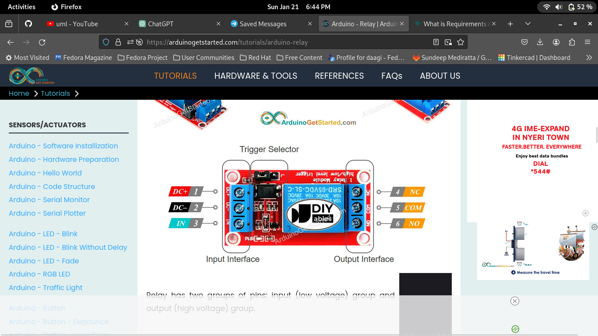

### Relay Code

A relay is a programmable switch that can be controlled by any microcontroller, or in this case an arduion Uno. Its used to programatically controll the on/off switches in devices that use high voltage/ current which might cause burning out of the microcontroller if used direclt on them.

> They act as a bridge between the **MCU** and high voltage devices.

Pins in the input group are connected to the arduino mcu via 3 pins:

+ **DC-** pin is connected to the GND pin
+ **DC+** needs to be connected to VCC
+ **IN** pin receives the control signal from the arduino board

Pins in the output group are conneceted to the high voltage device using 3 pins:

+ **COM** pin is the common pin. used in both normally open and normally closed mode
+ **NO** pin is the normally open pin. used in normally open
+ **NC** pin is the normally closed pin. used in normally closed
  Practically we rarely use all the pins, but instead only two of them:

In `Normally Open Mode`, we use the COM *(Common pin)* and NO *(Normally open)* pin. In `Normally open mode`, the circuit will become connected when the relay is activated, and the circuit is disconnected when the relay is inactive i.e *(circuit is closed unless otherwise stated)*.

In `Normally closed mode`, we use COM  *(Common pin)* and NC *(Normally closed)* pin. In `Normally Closed mode`, the circuit is disconnected when the relay is activated, and it is connected when the relay is inactive i.e *(circuit is open unless otherwise stated)*

a 

to controll a device using a relay, we simply use it similarly to an LED:

1. connect an arduino pin to the IN pin of the relay
2. control the relay by programming the pin to the LOW or HIGH

the code for this is

```C++
// constants won't change
const int RELAY_PIN = 3;  // the Arduino pin, which connects to the IN pin of relay

// the setup function runs once when you press reset or power the board
void setup() {
  // initialize digital pin as an output.
  pinMode(RELAY_PIN, OUTPUT);
}

// the loop function runs over and over again forever
void loop() {
  digitalWrite(RELAY_PIN, HIGH);
  delay(500);
  digitalWrite(RELAY_PIN, LOW);
  delay(500);
}
```

---------

**ADDITIONALY**

Relays can be able to controll more than one device. This is be having multiple **IN** pins to receive diffrent signals from the MCU. As such we can have a;

+ 2 Channel Relay - has 2 different **IN** pins and is able to controll two diffferent devices.
+ 4 Channel Relay - has 4 diffrent **IN** pins, and is able to controll four different dvices.

Code for running a 2 Channel Relay is as below:-

```C++
#define PIN_RELAY_1  2 // the Arduino pin, which connects to the IN1 pin of relay module
#define PIN_RELAY_2  3 // the Arduino pin, which connects to the IN2 pin of relay module

// the setup function runs once when you press reset or power the board
void setup() {
  Serial.begin(9600);

  // initialize digital pin as an output.
  pinMode(PIN_RELAY_1, OUTPUT);
  pinMode(PIN_RELAY_2, OUTPUT);
}

// the loop function runs over and over again forever
void loop() {
  Serial.println("Turn on both relays");
  digitalWrite(PIN_RELAY_1, HIGH);
  digitalWrite(PIN_RELAY_2, HIGH);
  delay(2000);

  Serial.println("Turn off both relays");
  digitalWrite(PIN_RELAY_1, LOW);
  digitalWrite(PIN_RELAY_2, LOW);
  delay(2000);
}
```

for a 4-channel relay:

```C++


#define PIN_RELAY_1  2 // the Arduino pin, which connects to the IN1 pin of relay module
#define PIN_RELAY_2  3 // the Arduino pin, which connects to the IN2 pin of relay module
#define PIN_RELAY_3  4 // the Arduino pin, which connects to the IN3 pin of relay module
#define PIN_RELAY_4  5 // the Arduino pin, which connects to the IN4 pin of relay module


// the setup function runs once when you press reset or power the board
void setup() {
  Serial.begin(9600);

  // initialize digital pin as an output.
  pinMode(PIN_RELAY_1, OUTPUT);
  pinMode(PIN_RELAY_2, OUTPUT);
  pinMode(PIN_RELAY_3, OUTPUT);
  pinMode(PIN_RELAY_4, OUTPUT);
}

// the loop function runs over and over again forever
void loop() {
  Serial.println("Turn on all");
  digitalWrite(PIN_RELAY_1, HIGH);
  digitalWrite(PIN_RELAY_2, HIGH);
  digitalWrite(PIN_RELAY_3, HIGH);
  digitalWrite(PIN_RELAY_4, HIGH);
  delay(1000);

  Serial.println("Turn off all");
  digitalWrite(PIN_RELAY_1, LOW);
  digitalWrite(PIN_RELAY_2, LOW);
  digitalWrite(PIN_RELAY_3, LOW);
  digitalWrite(PIN_RELAY_4, LOW);
  delay(1000);
}
```

------------
