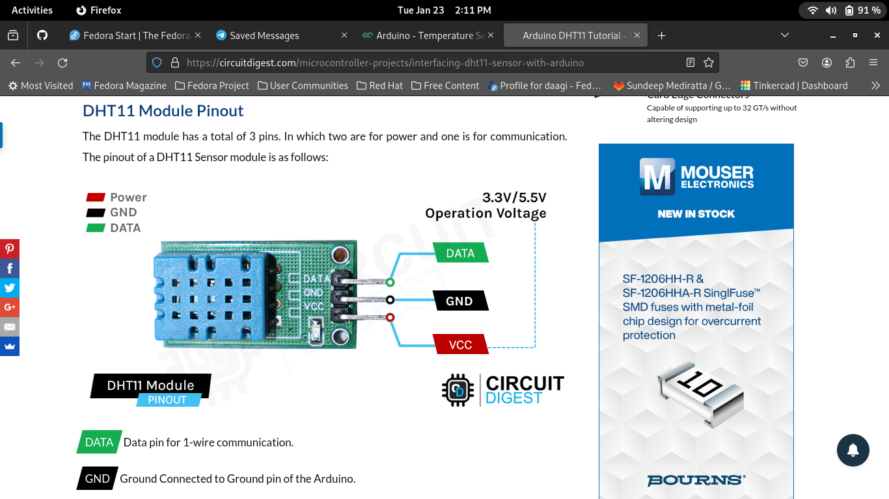

### Code to read temperature on DHT11

I used a DHT11 sensor, it is an industry favourite due to its ability to measure both temperature and humidity. The DHT11 is a basic, ultra-low-cost digital temperature and humidity sensor. It uses a capacitive humidity sensor and a thermistor to measure the surrounding air and sends data through a 1-wire protocol. In this instance however, we will only use it for the tmperature measurement.

It has 3 pins:
+ `Signal`- will be used to transmit readings from the sensor to the board
+ `VCC`- power pin, in which you supply the 5V
+ `GND`- ground pin 


> DHT11 can measure temperature from 0-50⁰C with a 2% accuracy and relative humidity from 20-80% with an accuracy of 5%.


the code for the making the sensor work is:
```C++

// Include the DHT11 library for interfacing with the sensor.
#include <DHT11.h>

// Create an instance of the DHT11 class.
// - For Arduino: Connect the sensor to Digital I/O Pin 2.
// - For ESP32: Connect the sensor to pin GPIO2 or P2.
// - For ESP8266: Connect the sensor to GPIO2 or D4.
int readPin = 2;
int waitTime = 1000;
DHT11 dht11(readPin);

void setup()
{
    // Initialize serial communication to allow debugging and data readout.
    // Using a baud rate of 9600 bps.
    Serial.begin(9600);
}

void loop()
{
    // Attempt to read the temperature value from the DHT11 sensor.
    int temperature = dht11.readTemperature();

    // Check the result of the reading.
    // If there's no error, print the temperature value.
    // If there's an error, print the appropriate error message.
    if (temperature != DHT11::ERROR_CHECKSUM && temperature != DHT11::ERROR_TIMEOUT)
    {
        Serial.print("Temperature: ");
        Serial.print(temperature);
        Serial.println(" °C");
    }
    else
    {
        Serial.println(DHT11::getErrorString(temperature));
    }

    // Wait for 1 seconds before the next reading.
    delay(waitTime);
}


```